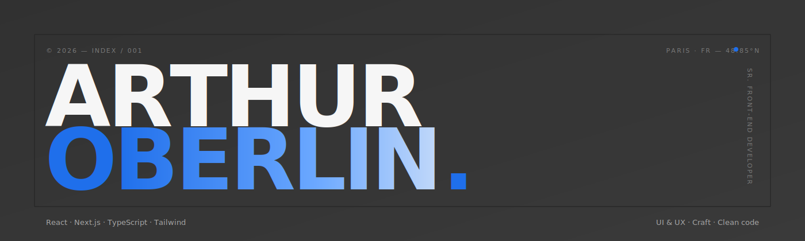

<div align="center">
  
</div>

<br/>

```
┌─ index ─────────────────────────────────────────────┐
│  01  Présentation                                   │
│  02  Parcours                                       │
│  03  Stack                                          │
│  04  Disponibilité                                  │
│  05  Contact                                        │
└─────────────────────────────────────────────────────┘
```

<br/>

## ` 01 ` Présentation

> **Développeur Front-end Senior** à Paris — 7 ans à concevoir et coder des interfaces pour le web.

Je viens du Front, mais le design n'est jamais loin. J'aime les projets où l'**UX/UI** est traitée comme un sujet en soi, pas comme une variable d'ajustement en fin de cycle. Une interface réussie ne se remarque pas — elle laisse passer ce que les gens viennent y faire.

Au fil des années, j'ai eu la chance de travailler sur des terrains **très créatifs** : médias, jeux navigateur, éditorial, e-commerce, robotique. Chaque univers a sa propre grammaire visuelle, ses contraintes, son public — et c'est exactement ce qui me plaît : passer d'un langage à un autre tout en gardant la même exigence.

Une obsession qui m'accompagne sur chaque projet : **l'accessibilité**. Une belle interface qui exclut une partie des utilisateurs n'est pas une belle interface. Navigation clavier, contrastes, sémantique, lecteurs d'écran — ce sont des fondations, pas un bonus.

Et puis surtout, j'aime **travailler à plusieurs**. Les meilleurs produits que j'ai vu naître sont sortis d'équipes où designers, devs et PM se parlent vraiment, et où chacun apporte au champ de l'autre.

<br/>

## ` 02 ` Parcours

```
🎬  Médias & culture      ──  Konbini · sites éditoriaux & jeux navigateur
🏦  Banque & finance      ──  Interfaces de gestion · dashboards
🤝  SaaS CSE              ──  Plateformes à fort volume · tests · fiabilité
🛍️  E-commerce            ──  Funnels · performance perçue · micro-interactions
🤖  Robotique             ──  UI temps réel · dialogue avec le hardware
```

Côté **Konbini**, j'ai notamment travaillé sur leurs jeux navigateur multijoueurs (React / xState) et leur site éditorial en Next.js.

<br/>

## ` 03 ` Stack

**Front-end &nbsp;◇**
&nbsp;&nbsp;
&nbsp;
&nbsp;
&nbsp;
&nbsp;

**State, data, motion &nbsp;◇**
&nbsp;&nbsp;
&nbsp;
&nbsp;
&nbsp;

**Styling & UI &nbsp;◇**
&nbsp;&nbsp;
&nbsp;
&nbsp;
&nbsp;
&nbsp;

**Testing & qualité &nbsp;◇**
&nbsp;&nbsp;
&nbsp;
&nbsp;
&nbsp;
&nbsp;

**Back & infra &nbsp;◇**
&nbsp;&nbsp;
&nbsp;
&nbsp;
&nbsp;
&nbsp;
&nbsp;

**Design & flow &nbsp;◇**
&nbsp;&nbsp;
&nbsp;
&nbsp;
&nbsp;

<br/>

## ` 04 ` Disponibilité

```diff
@@ Statut · Mai 2026 @@
+ Disponible pour des missions freelance
+ Ouvert aux opportunités Senior Front-end
+ Sur Paris ou en remote
```

<br/>

## ` 05 ` Contact

&nbsp;&nbsp;**◆ &nbsp;Portfolio** &nbsp;&nbsp;→&nbsp;&nbsp; [arthuroberlin.fr](https://arthuroberlin.fr)  
&nbsp;&nbsp;**◆ &nbsp;LinkedIn** &nbsp;&nbsp;&nbsp;→&nbsp;&nbsp; [in/arthuroberlin](https://www.linkedin.com/in/arthuroberlin/)  
&nbsp;&nbsp;**◆ &nbsp;Malt** &nbsp;&nbsp;&nbsp;&nbsp;&nbsp;&nbsp;&nbsp;→&nbsp;&nbsp; [arthuroberlinmartins](https://www.malt.fr/profile/arthuroberlinmartins)

<br/>

```
─────────────────────────────────────────────────────────
   Designed & coded with ❤️         ·        Paris, FR
─────────────────────────────────────────────────────────
```
